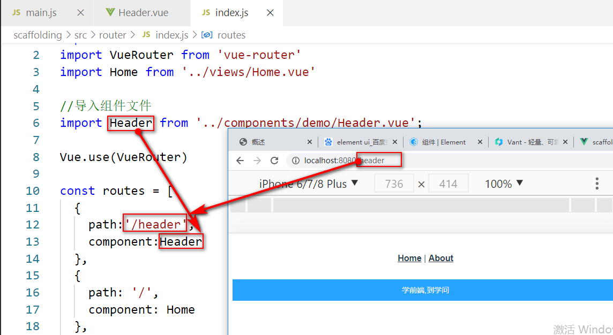
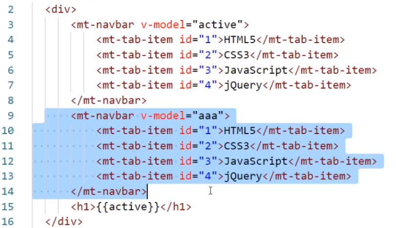
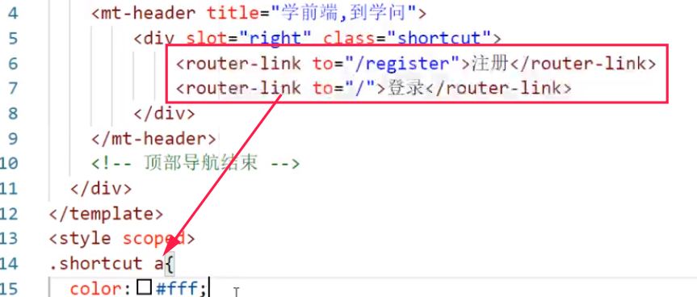

# Mint UI

- [Mint UI](#mint-ui)
  - [01-day](#01-day)
    - [1 组件库基础](#1-组件库基础)
    - [2 Mint UI](#2-mint-ui)
  - [02-day](#02-day)
    - [1 关于Mint UI 中表单控件获取/失去焦点](#1-关于mint-ui-中表单控件获取失去焦点)
  - [常见错误](#常见错误)
    - [01 hash 与 history 决定url浏览器访问地址栏中带不带#号](#01-hash-与-history-决定url浏览器访问地址栏中带不带号)
    - [02 失去焦点用法错觉](#02-失去焦点用法错觉)
    - [03 @blur.native.capture="unameBlur"写法是否只对Mint UI有效](#03-blurnativecaptureunameblur写法是否只对mint-ui有效)
    - [04 mt-navbar组件中包含的子组件id唯一就行](#04-mt-navbar组件中包含的子组件id唯一就行)
    - [05 Tabbar组件设置fixed属性,会覆盖面板内容](#05-tabbar组件设置fixed属性会覆盖面板内容)
    - [06 router-link跳转标签的样式修改--跳坑](#06-router-link跳转标签的样式修改--跳坑)

---

## 01-day

### 1 组件库基础

1. 什么是组件库?

   组件(Component)是企业为提升开发效率而开发的针对应用的, 结构, 表现及行为的封装. 组件的有点在于 **一次定义, 多次使用** .

2. 组件库的优势

   - 提升开发效率
   - 提升项目的可维护性
   - 便于团队的协作开发

3. 组件库的分类

   - (1). 移动端组件库
      - `Mint UI` (饿了么) -- [http://mint-ui.github.io/#!/zh-cn](http://mint-ui.github.io/#!/zh-cn)
      - `Vant UI` (有赞) -- [https://youzan.github.io/vant/#/zh-CN/](https://youzan.github.io/vant/#/zh-CN/)
      - `Cube UI` (滴滴) -- [https://didi.github.io/cube-ui/#/zh-CN](https://didi.github.io/cube-ui/#/zh-CN)

   - (2). PC端组件库
      - `Element UI` (饿了么) -- [https://element.eleme.cn/#/zh-CN](https://element.eleme.cn/#/zh-CN)
      - `AT-UI` (凹凸实验室) -- [https://at-ui.github.io/at-ui/#/zh](https://at-ui.github.io/at-ui/#/zh)
      - `View UI` (视图更新) -- [https://www.iviewui.com/](https://www.iviewui.com/)

### 2 Mint UI

1. 安装步骤

   - (1). 命令行切换到该项目下
   - (2). 输入命令:`npm install --save mint-ui`
   - (3). 检查`package.json`文件中mit-ui的注册信息

2. 引入

   在`src/main.js` 中输入一下代码:

   ```js
   // 导入Mint UI
   import MintUI from 'mint-ui'

   // 导入Mint UI的样式表文件(library,库)
   import 'mint-ui/lib/style.min.css'

   // 通过Vue.use()方法注册为插件
   Vue.use(MintUI)
   ```

3. MInt UI组件库的组成

   - CSS组件
   - JS组件
   - 表单组件

4. 使用MInt UI

   - (1). 引入外部`reset.css`样式
      - a. 原因: 所有的`HTML`元素都有默认样式，而且不同的浏览器的默认样式是不相同的，为了保证所有浏览器的默认样式相同.
      - b. 操作步骤:
            i. 将`reset.css`放置在`public/css`目录内
            ii. 编辑`public/index.html`，在头部书写以下语句

         ```html
         <link type="text/css" rel="stylesheet" href="/css/reset.css">
         ```

   - (2). `Header` 组件
      - a. 案例: 实现顶部固定导航栏
      - b. 操作步骤:
         - 1). 新建文件`Header.vue`, 存放路径为:00-demo/src/components/test/Header.vue (这里在components中新建了一个test文件夹,存放测试的组件)
         - 2). 在Header.vue中写入代码如下:

            ```html
            <!-- 
               fixed: 为boolean属性，用于控制顶部导航固定在顶部(不会随页面的滚动而滚动).
            -->
            <mt-header title="标题信息" fixed>
               ...
            </mt-header>
            ```

         - 3). 路由中导入Header.vue, 代码如下:

            ```js
            // 导入Header.vue
            import Header from '../components/test/Header.vue'

            const routes = [
               {
                  path: '/header',
                  name: 'Header',
                  component: Header
               },
               ...
            ]
            ```

         

   - (3). `Button`组件
      - 用于实现按钮，其语法结构是：

         ```html
         <mt-button
            type="按钮类型"
            size="按钮尺寸"
            icon="按钮图标型"
            disabled
            plain>
            ...
         </mt-button>
         ```

      > 按钮类型包括：`default`(默认)、`primary`(主要的)、 `danger`(危险的).
      >
      > 按钮尺寸包括：`small`(小的)、`normal`(标准的)、`large`(大的).
      >
      > 按钮图标包括：`back`(返回)、`more`(更多).
      >
      > 可以在按钮内嵌套图像，并且为图像添加`slot="icon"`属性，此时该图像将作为按钮的图标来呈现(优先级高于`icon`属性).
      >
      > 图标尺寸一般为：`24X24`、`32X32`、`48X48`、`64X64`.
      >
      > `plain`属性为布尔属性，表示按钮是否为镂空按钮.

   - (4). `Field`组件
      用于实现表单控件，其语法结构是：

      ```html
      <mt-field
         type="表单控件的类型"
         label="标签"
         placeholder="占位符"
         state="检测状态"
         disableClear
         :attr="原生属性"
         readonly
         disabled
         v-model="变量名称">
       </mt-field>
      ```

      - a. 表单控件的类型包括：
         - 1). `text`，单行文本框
         - 2). `password`，密码框
         - 3). `textarea`，多行文本框
         - 4). `number`，数字
         - 5). `url`,`URL`地址，如网域

      - b. `state`属性用于标识表单控件的检测状态，其值为`success`(成功)、`warning`(警告)、`error`(错误).

      - c. `disableClear`属性为布尔属性，表示是否禁用`clear`按钮.

      - d. `:attr`为组件的原生属性，对象类型，形如：
  
         ```html
         <mt-field
            type="text"
            :attr="{maxlength:'10',autocomplete:'off'}">
         </mt-field>
         ```

      - d. `readonly`属性为布尔属性，表示当前表单控件是否为只读.

      - e. `disabled`属性为布尔属性，表示当前表单控件是否禁用.

      - f. 案例: 用户注册
         - 1). 新建Resign.vue文件, 路径为: 00-demo/src/components/test/Resign.vue

         ```js
         <template>
            <div>
               <mt-header title="注册">
                  <router-link to="/" slot="left">
                  <mt-button icon="back"></mt-button>
                  </router-link>
               </mt-header>
               <mt-field
                  type="text"
                  label="用户:"
                  :state="unameState"
                  disabledClear
                  v-model="uname"
                  @blur.native.capture="unameBlur"
                  @focus.native.capture="unameFocus"
               ></mt-field>

               <mt-field
                  type="password"
                  label="密码:"
                  :state="pwdState"
                  disabledClear
                  :attr="{maxlength:'10', autocomplete:'off'}"
                  v-model="passwd"
                  @blur.native.capture="pwdBlur"
                  @focus.native.capture="pwdFocus"
               ></mt-field>
               <mt-field
                  type="password"
                  label="确认密码:"
                  :state="rpwdState"
                  disabledClear
                  :attr="{maxlength:'10', autocomplete:'off'}"
                  v-model="rpasswd"
                  @blur.native.capture="rpwdBlur"
                  @focus.native.capture="rpwdFocus"
               ></mt-field>
               <mt-button type="primary" size="large" @click="regin">免费注册</mt-button>
            </div>
            </template>

            <script>
            export default {
            data() {
               return {
                  uname: "",
                  passwd: "",
                  rpasswd: "",
                  unameState: "",
                  pwdState: "",
                  rpwdState: "",
                  regExp: /^[A-Za-z0-9]{6,12}$/,
               };
            },
            methods: {
               regin() {
                  if (this.uname != null && this.passwd != null && this.rpasswd) {
                  this.$toast({
                     message: "注册成功",
                     iconClass: "icon icon-success",
                  });
                  } else {
                  // console.log(`请输入合法的用户名`);
                  // 精简写法
                  // this.$toast('请输入合法的用户名');
                  // 标准写法
                  this.$toast({
                     message: "注册信息不能为空",
                     position: "top",
                     className: "msg",
                     duration: 1500,
                  });
                  }
               },
               unameFocus() {
                  this.unameState = "";
               },
               unameBlur() {
                  if (!this.uname) {
                  this.unameState = "";
                  } else {
                  if (this.regExp.test(this.uname)) {
                     if ("admin888" == this.uname) {
                        this.$messagebox("提示", "该用户名已存在!");
                     } else {
                        this.unameState = "success";
                     }
                  } else {
                     this.unameState = "error";
                  }
                  }
               },
               pwdFocus() {
                  this.pwdState = "";
               },
               pwdBlur() {
                  if (!this.passwd) {
                  this.pwdState = "";
                  } else {
                  if (this.regExp.test(this.passwd)) {
                     this.pwdState = "success";
                  } else {
                     this.pwdState = "error";
                  }
                  }
               },
               rpwdFocus() {
                  this.rpwdState = "";
               },
               rpwdBlur() {
                  if (!this.rpasswd) {
                  this.rpwdState = "";
                  } else {
                  if (this.passwd == this.rpasswd) {
                     this.rpwdState = "success";
                  } else {
                     this.rpwdState = "error";
                  }
                  }
               },
               // },
               // watch: { // 专门放监视函数的区域
               //   uname() {
               //     console.log(this.uname);
               //     if (this.regExp.test(this.uname)) {
               //       this.unameState = "success";
               //     }else {
               //       this.unameState = "error";
               //     }
               //   },
               //    passwd() {
               //     console.log(this.passwd);
               //     if (this.regExp.test(this.passwd)) {
               //       this.pwdState = "success";
               //     }else {
               //       this.pwdState = "error";
               //     }
               //   },
               //    rpasswd() {
               //     console.log(this.rpasswd);
               //     if (this.passwd === this.rpasswd) {
               //       this.rpwdState = "success";
               //     }else {
               //       this.rpwdState = "error";
               //     }
               //   }
            }
            };
            </script>

            <style>
            .msg {
            background-color: pink !important;
            }
            .mint-cell-title {
            text-align: right;
            }
            </style>
         ```

      - 2). Resign.vue导入路由. 路径为: 00-demo/src/router/index.js

         ```js
         // 导入Resign.vue
         import Resign from '../components/test/Resign.vue'

         const routes = [
            {
               path: '/resign',
               name: 'Resign',
               component: Resign
            },
            ...
         ]
         ```

   - (5). `Toast`组件
      用于显示短消息示提示框，其语法结构是

      ```js
      //简捷语法
      this.$toast("提示内容")

      //标准语法
      this.$toast({
            message:"提示内容",
            position:"提示框的位置(top|middle|bottom)"
            duration:持续时间(单位为毫秒,默认为3000)
      })
      ```

   - (6). `Messagebox`组件
      用于显示消息提示框，语法结构是:

      ```js
      //简捷语法
       this.$messagebox("标题信息","提示内容")
      ```

## 02-day

### 1 关于Mint UI 中表单控件获取/失去焦点

1. where:

   ```html
   <mt-field
      type="text"
      @focus.native.capture="函数方法"
      @blur.native.capture="函数方法">
   </mt-field>
   ```

2. Vue事件修饰符: `native`, `stop`, `prevent`, `capture` 等

3. `Mint UI`组件(续)

   - (1). `Navbar`组件
      顶部选项卡, 与 Tabbar 类似, 依赖 tab-item 组件.
      - a. 语法结构:

         ```html
         <mt-navbar v-model="变量名" fixed>
            <mt-tb-item id="当前选项卡的ID">
               ...
         </mt-navbar>
         ```

      - b. `navbar`绑定的变量的值应该为`mt-tab-item`中的`id`
      - c. `mt-tab-item`的`id`只要在当前容器内唯一即可
      - d. 如在`<mt-tab-item>`中嵌套图像, 并且为图像设置`slot="icon"`属性的话, 该图像将作为选项卡的图标出现.

   - (2). `tabContainer`组件
      用于实现面板.
      - a. 语法结构:

         ```html

         ```

## 常见错误

### 01 hash 与 history 决定url浏览器访问地址栏中带不带#号

   ```js
   const router = new VueRouter({
      mode: 'history', // URL -> 浏览器姿地址栏访问时不带 # 号, 如果改为'hash', 则URL -> 浏览器姿地址栏访问时带 # 号
      base: process.env.BASE_URL,
      routes
   })
   ```

### 02 失去焦点用法错觉

正确写法: `@blur.native.capture="unameBlur"`, 不要遗漏掉`.native.capture`.

### 03 @blur.native.capture="unameBlur"写法是否只对Mint UI有效

### 04 mt-navbar组件中包含的子组件id唯一就行

如:两个不同的`mt-navbar`组件, 但是他们的子组件可以有相同的id值



### 05 Tabbar组件设置fixed属性,会覆盖面板内容

解决方法: 设置margin值即可

### 06 router-link跳转标签的样式修改--跳坑

解决方法: 操作编译后的样式属性,而不是直接把`routerlink`作为标签属性, 因为在vue脚手架解析编译, 到浏览器加载后是a标签


